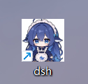

# DSH 快捷方式提示词

> 一份提示词。复制给 AI，让它帮你做一个点击就打开 DSH 的桌面快捷方式。

**这里只有提示词，没有现成的程序。** 每个人的图片、系统环境都不一样，
让 AI 按你的情况生成一份，比套用别人的成品省事。自始至终只需要你准备一张图片。

## 这是什么

一份写给 AI 的提示词。你把提示词加一张图片的路径发给 AI，
AI 会给你一个启动器脚本和一张图标。之后双击桌面图标就能打开 DSH，不用再敲命令。

提示词里已经把 DSH 怎么启动、装在哪、怎么处理登录链接全部写好了，
**你不需要知道 DSH 装在哪里，也不用告诉 AI**。

## 你需要准备什么

| # | 准备什么 | 要求 |
|---|---|---|
| 1 | 一张图片 | `.png` 或 `.jpg`，正方形最好（长方形会被压扁）。什么图都行 |
| 2 | 装好 DSH | 平时能打开 DSH 就可以 |

## 怎么用

1. **把图片放桌面**，记下它的路径，例如 `C:\Users\你的名字\Desktop\logo.png`
2. **打开 [PROMPT.md](PROMPT.md)**，把「三、提示词正文」那一整块复制下来
3. **粘贴给 AI**，然后在后面补一句：`我的图标图片在这里：C:\...\logo.png`
4. **收下 AI 给你的文件**，放在同一个文件夹里，比如新建一个 `DSH快捷方式`
5. **先检查，再试跑**（看下一节）

## 生成之后怎么检查

| 步骤 | 看什么 | 正常的样子 |
|---|---|---|
| 1 | 跑 `-SelfTest` | 打印一张表，node 和 DSH 都找到了 |
| 2 | 双击启动器 | DSH 界面打开了，**没有黑框闪过、任务栏没有多余的东西** |
| 3 | 再双击一次 | 很快打开窗口，不会重复启动 |
| 4 | 看图标 | 是你给的那张图，不是一张白纸 |

哪一步不对，就把 `-SelfTest` 打印的表**整段复制回去**发给 AI 让它改。
**不要自己动手改代码**，很容易改出新问题。

## 提示词给 AI 划的边界

提示词里明确要求 AI 不能做这些事，你可以拿它核对生成的结果：

- 不安装、不升级、不修改、不删除你的 DSH
- 不读取你的会话、配置、凭据
- 不终止不是它自己启动的进程
- 只允许写两个地方：它自己的运行目录、桌面快捷方式

## 许可

MIT

---

## 效果图

桌面上的样子：

